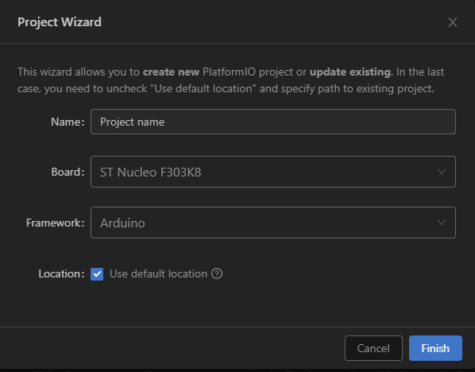

# Self-balancing Robot

## Table of Contents
* [Overview ](#Overview)
* [Description ](#Description)
* [Tools](#Tools)
* [How to use](#How-to-use)
* [Future improvements](#Future-improvements)
* [Attributions](#Attributions)
* [License](#License)
* [Credits](#Credits)

## Overview 
Our project is a self-balancing robot.

## Description 
Equipment we used:
* STM32F303K8T6 microcontroller 
* MPU6050 gyro
* LM2596 step-down power supply module
* TB6612FNG dual channel motor driver
* TT motors 6V 1:48
* 2S1P pack made by 18650 4,2V batteries  - full voltage is going to motors, for microcontroller
is reduced to 5V 

## Tools 
* Project is built using the [PlatformIO](https://platformio.org) (3.6.7). Based on the Arduino framework.
* Language C++ 
* [I2C Device Library](https://github.com/jrowberg/i2cdevlib)

## How to use
* Install [PlatformIO IDE](https://docs.platformio.org/en/latest/ide.html#platformio-ide)
* Set up PlatformIO project for ST Nucleo F303K8 and Arduino Framework

* check your `platformoi.ini` and add missing lines
```
[env:nucleo_f303k8]
platform = ststm32
lib_extra_dirs = ~/Documents/Arduino/libraries
board = nucleo_f303k8
framework = arduino
board_build.mcu = stm32f303k8t6
board_build.f_cpu = 72000000L
```
* Add this libs to ```lib``` folder in project root
  * [I2Cdev](https://github.com/jrowberg/i2cdevlib/tree/master/Arduino/I2Cdev)  
  * [MPU6050](https://github.com/jrowberg/i2cdevlib/tree/master/Arduino/MPU6050)
* Build and upload to board
* Make sure your robot stands in balance, or using some kind of base

## Future improvements
Definetely buy better motors

## Attributions
* [Jeff Rowberg](https://github.com/jrowberg) - creator of I2Cdevlib

## License
MIT License 

## Credits 
* [Bartłomiej Olszanowski](https://github.com/baloo1379)
* [Bartosz Porębski](https://github.com/baatheo)

The project was conducted during the Microprocessor Lab course held by the [Institute of Control and Information Engineering](http://www.cie.put.poznan.pl/index.php?lang=en), [Poznan University of Technology](https://www.put.poznan.pl/en).
Supervisor: [Tomasz Mańkowski](https://github.com/Tomasz-Mankowski)
